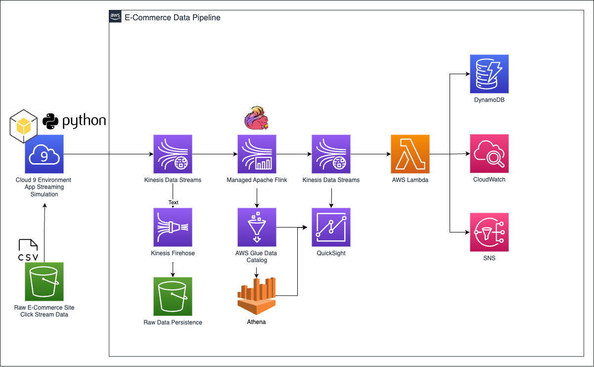
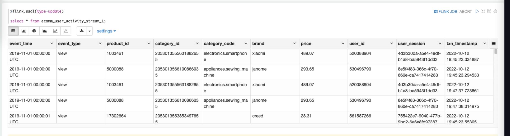
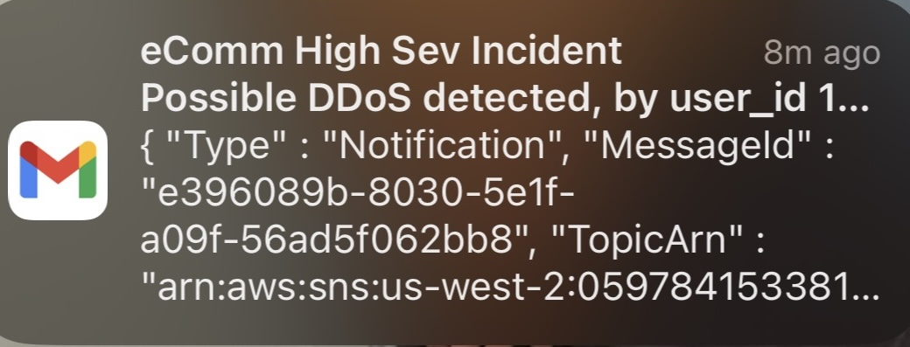
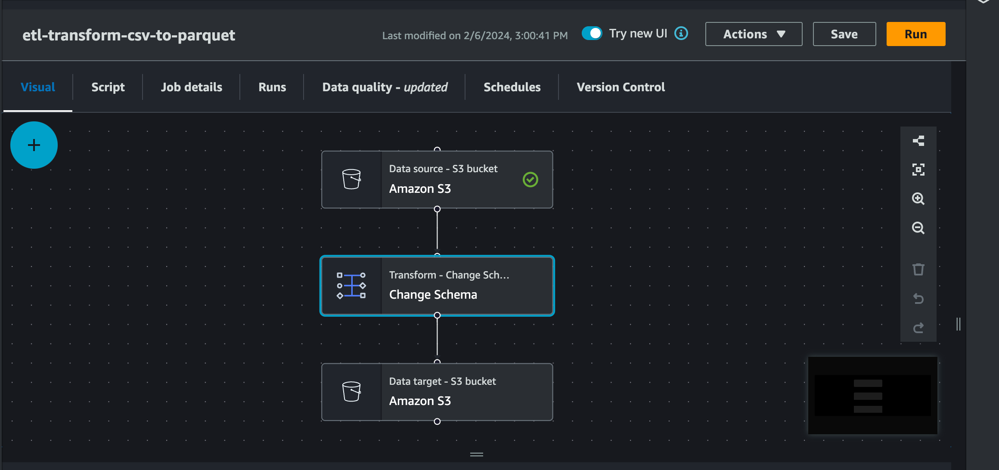
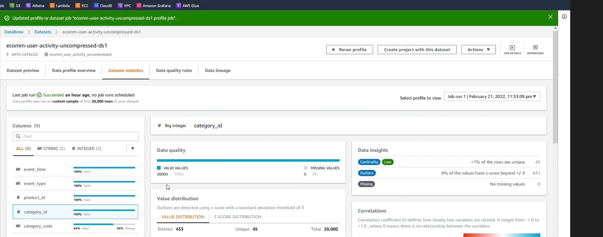
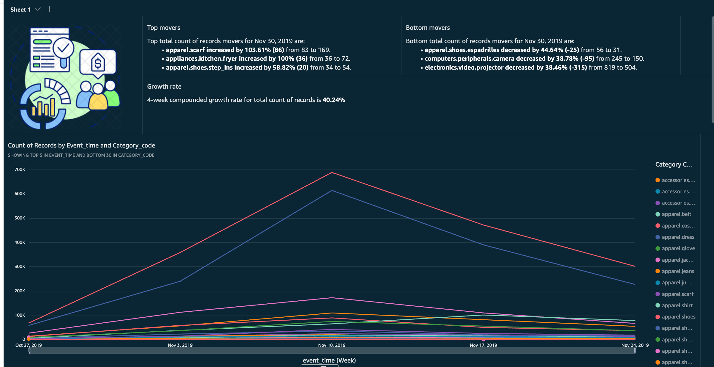
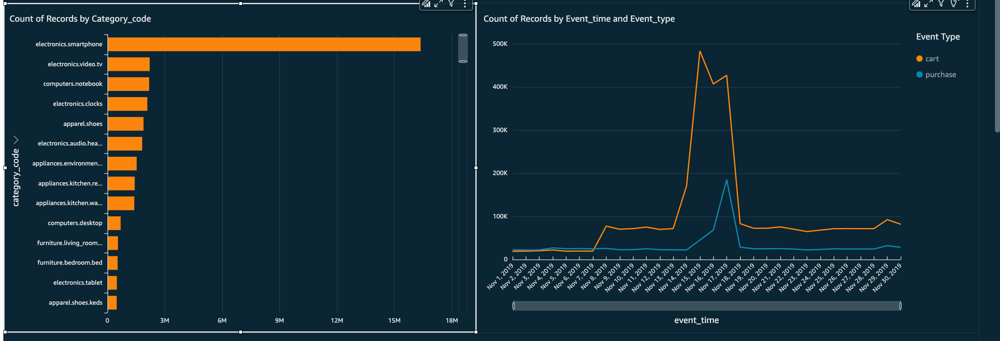
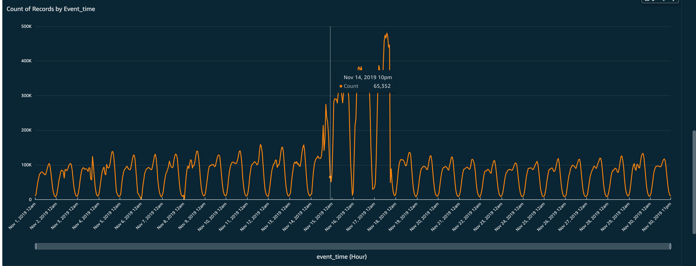
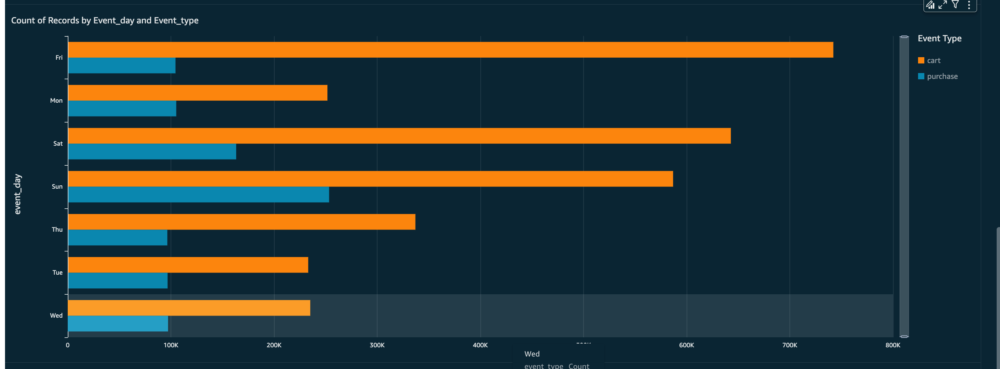
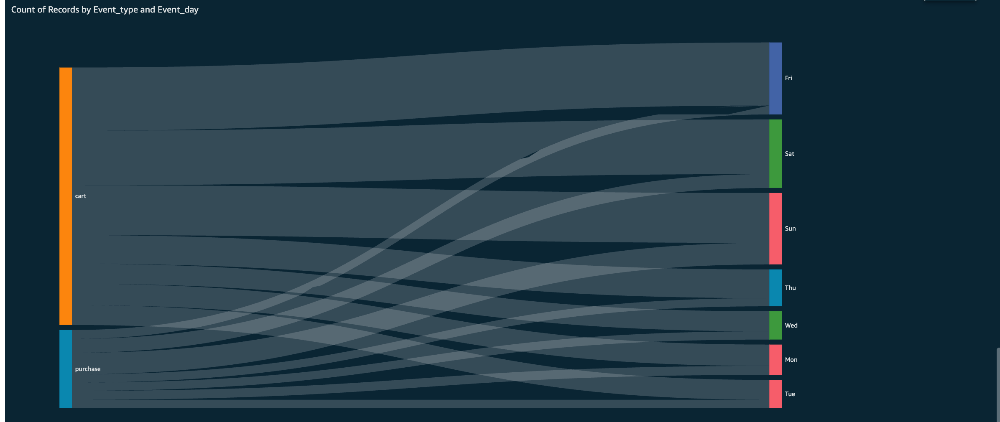

## Business Overview

In the dynamic realm of e-commerce, analytics serves as the backbone for understanding customer behaviors and shopping trends. This project taps into that by simulating user activity on an e-commerce platform, analyzing the journey from product views to purchases.

## Project Insights

We implement **\*Batch and Real-Time** analytical processes using an e-commerce dataset. The Batch Process harnesses AWS tools to analyze daily visitor trends, cart abandonment, and popular categories for targeted promotions and brand marketing strategies.

The Real-Time Process focuses on immediate threat detection, like DDoS and Bot attacks, using AWS Lambda, DynamoDB, CloudWatch, and SNS for swift response.



## Data Pipeline

Our data pipeline is a streamlined system for moving and processing data in batches or streams. It encompasses data collection, storage, cleaning, transformation, and the presentation of KPIs, ensuring a robust analytical framework for strategic decision-making.

## Dataset - ECommerce Behavior Data Analysis

This project utilizes a rich dataset from a multi-category store to understand customer behavior in an e-commerce setting. The dataset, sourced from Kaggle, encompasses a broad spectrum of user interactions over the months of October and November 2019.

Before diving into the analytics, we will start with a sample of the data to set up our environment and processes.

### Initial Dataset Setup

1. Obtain the dataset by navigating to the [Kaggle e-commerce behavior data page](https://www.kaggle.com/datasets/mkechinov/ecommerce-behavior-data-from-multi-category-store).

2. Creating a Sample Dataset: To create a manageable sample for initial testing, execute the following commands:

```bash
# Unzip the November dataset into the dataset directory
unzip 2019-Nov.csv.zip -d dataset/

# Create a sample file with the first 1000 lines of the November dataset
cat dataset/2019-Nov.csv | head -n 1000 > dataset/2019-Nov-sample.csv
```

# Amazon S3 Data Storage Setup

As part of the data pipeline setup for our E-commerce Behavior Data Analysis project, we will store our datasets in an Amazon S3 bucket. This allows us to manage our data in a secure, scalable, and easily accessible environment.

## Creating an S3 Bucket

The first step involves creating an S3 bucket where we will upload our datasets.

Create a bucket with the following name, ensuring that the region is set to `us-east-1` for development purposes:

- Bucket Name: `ecommerce-raw-us-east-1-dev`

This name follows a conventional naming pattern that includes the data type, the AWS region, and the environment stage (dev).

Execute the following commands in your terminal to upload the datasets to the appropriate S3 paths:

```bash
# Upload the October 2019 dataset
aws s3 cp dataset/2019-Oct.csv.zip s3://ecommerce-raw-us-east-1-dev/ecomm_user_activity/p_year=2019/p_month=10/

# Upload the November 2019 dataset
aws s3 cp dataset/2019-Nov.csv.zip s3://ecommerce-raw-us-east-1-dev/ecomm_user_activity/p_year=2019/p_month=11/

# Upload the November 2019 sample dataset
aws s3 cp dataset/2019-Nov-sample.csv s3://ecommerce-raw-us-east-1-dev/ecomm_user_activity_sample/202019-Nov-sample.csv

# Upload the uncompressed November 2019 dataset
aws s3 cp dataset/2019-Nov.csv s3://ecommerce-raw-us-east-1-dev/ecomm_user_activity_uncompressed/p_year=2019/p_month=11/
```

## Creating Data Streams for E-commerce Data Processing

Two data streams are required for ingesting and processing e-commerce data:

1. Data Stream for App Simulation Clickstream Data:

- Stream Name: `ecommerce-raw-user-activity-stream-1`
- Capacity Mode: `On-demand`
  This data stream is responsible for ingesting clickstream data generated by the e-commerce app simulation.

2. Data Stream for Analyzed and Streamed Data:

- Stream Name: `ecommerce-raw-user-activity-stream-2`
- Capacity Mode: `On-demand`
  This data stream handles data after it has been processed by analytics and streaming analytics using Apache Flink.

## Simulating E-commerce Workload for Real-time Data Streaming

The provided Python script stream-data-app-simulation.py simulates real-time data streaming from an e-commerce application. This script reads data from a CSV file stored in an S3 bucket, converts each row into JSON format, and sends it to a Kinesis Data Stream.

##3 Script Overview:

1. AWS Settings:
   The script initializes the AWS clients for S3 and Kinesis in the specified AWS region.

2. Environment Variables:

- kinesis_stream_name: Name of the Kinesis Data Stream where the data will be sent.
- streaming_partition_key: The key used for partitioning data in the Kinesis stream.

3. Function stream_data_simulator:

- Reads the CSV file from the specified S3 bucket and key.
- Iterates over each row in the CSV file.
- Converts the row into JSON format.
- Adds a fake transaction timestamp.
- Sends the JSON data to the Kinesis Data Stream using the put_record method.

4. Running the Stream:

The script runs the stream_data_simulator function for a specified number of iterations. Each iteration reads data from the same CSV file and sends it to the Kinesis Data Stream.

Output:
The script prints the response from the put_record operation for each data record sent to the Kinesis Data Stream. A successful response indicates that the data was successfully sent to the stream.

Example Output:

```bash
{'ShardId': 'shardId-000000000003', 'SequenceNumber': '49648984969890691415004527695771943445790640323793256498', 'ResponseMetadata': {'RequestId': 'fb51c31c-eaa0-83ee-a56d-dd7810bb5100', 'HTTPStatusCode': 200, ...}}
{'ShardId': 'shardId-000000000001', 'SequenceNumber': '49648984969846089924607466449490080935064958229956001810', 'ResponseMetadata': {'RequestId': 'c4abe011-240a-bc46-9a97-fe75de116ea8', 'HTTPStatusCode': 200, ...}}
```

The successful response indicates that the data records were sent to the respective shards in the Kinesis Data Stream.

## Integrating with Kinesis Data Analytics and Apache Flink

After setting up the data streams and simulating real-time data ingestion, the next step is to integrate with Kinesis Data Analytics and Apache Flink for real-time data processing. Follow the steps below:

1. Create a Glue Crawler:

   - Name: ecomm-user-activity-crawler-1
   - Data Source: s3://ecommerce-raw-us-east-1-dev/ecomm_user_activity_sample/2019-Nov-sample.csv
   - Database Name: db-ecommerce-raw
   - Run the crawler to catalog the data.

2. Kinesis Data Analytics Notebook Setup:
   Create a Kinesis Data Analytics notebook, such as a Zeppelin notebook, and grant appropriate permissions to access both streams.

3. Configure Streaming Analytics:
   Use the provided SQL code to configure streaming analytics in the Kinesis Data Analytics notebook. This code aims to create tables for stream-1 and stream-2 as well as detect user IDs with more than one num_actions_per_watermark in stream-1 and send it to stream-2.

```sql
%flink.ssql

/* Define schema for ecomm_user_activity_stream_1 */
DROP TABLE IF EXISTS ecomm_user_activity_stream_1;

CREATE TABLE ecomm_user_activity_stream_1 (
  `event_time` VARCHAR(30),
  `event_type` VARCHAR(30),
  `product_id` BIGINT,
  `category_id` BIGINT,
  `category_code` VARCHAR(30),
  `brand` VARCHAR(30),
  `price` DOUBLE,
  `user_id` BIGINT,
  `user_session` VARCHAR(30),
  `txn_timestamp` TIMESTAMP(3),
  WATERMARK FOR txn_timestamp as txn_timestamp - INTERVAL '10' SECOND
)
PARTITIONED BY (category_id)
WITH (
  'connector' = 'kinesis',
  'stream' = 'ecommerce-raw-user-activity-stream-1',
  'aws.region' = 'us-east-1',
  'scan.stream.initpos' = 'LATEST',
  'format' = 'json',
  'json.timestamp-format.standard' = 'ISO-8601'
);

/* Define schema for ecomm_user_activity_stream_2 */
DROP TABLE IF EXISTS ecomm_user_activity_stream_2;

CREATE TABLE ecomm_user_activity_stream_2 (
  `user_id` BIGINT,
  `num_actions_per_watermark` BIGINT
)
WITH (
  'connector' = 'kinesis',
  'stream' = 'ecommerce-raw-user-activity-stream-2',
  'aws.region' = 'us-east-1',
  'format' = 'json',
  'json.timestamp-format.standard' = 'ISO-8601'
);

/* Insert aggregation into Stream 2 */
INSERT INTO ecomm_user_activity_stream_2
SELECT  user_id, COUNT(1) AS num_actions_per_watermark
FROM ecomm_user_activity_stream_1
GROUP BY TUMBLE(txn_timestamp, INTERVAL '10' SECOND), user_id
HAVING COUNT(1) > 1;
```

4. Query Streaming Data:
   Ensure that the data simulation is running, then query the streaming data using the following SQL command:

```sql
%flink.ssql(type=update)

SELECT * FROM ecomm_user_activity_stream_1;
```

5. Deployment:
   Once testing is completed and the application is ready, create a build of your application in an S3 bucket. Deploy the application as a streaming application for continuous real-time data processing.



### Prevention Against DDoS Attacks Using Lambda, CloudWatch & SNS

- Create the Lambda Function
  - Name : `ecomm-detect-high-event-volume`
  - Python Version : 3.7

The Lambda function `ecomm-detect-high-event-volume` plays a critical role in analyzing data from `ecommerce-raw-user-activity-stream-2` to identify suspicious activity or signs of a distributed denial-of-service (DDoS) attack. Here's a concise overview of its key functionality:

### Deaggregation of Records:

- The function uses the aws_kinesis_agg package to deaggregate records received from the ecommerce-raw-user-activity-stream-2. This step is crucial as Kinesis streams often aggregate records, and deaggregation is necessary to process individual items effectively.

### Processing and Storage in DynamoDB:

- Each deaggregated record is processed to extract relevant information, such as user ID and the number of actions per watermark.
- This extracted data is then stored in DynamoDB for further analysis and monitoring. To handle multiple write operations efficiently, the function utilizes DynamoDB's batch writer.

### CloudWatch Metrics:

- The Lambda function generates CloudWatch metrics to monitor event frequencies, including high-volume user activity. These metrics provide insights into system behavior and health, facilitating proactive monitoring and alerting.

### Detection of DDoS Activity:

- The function includes logic to detect potential DDoS activity by analyzing the number of actions per watermark.
- If the number of actions exceeds a predefined threshold (e.g., more than 10 actions within a specified time window), the function triggers an email notification via Amazon SNS.
- This email notification serves as an alert to administrators or security personnel, prompting them to investigate and mitigate potential threats promptly.



## Deploy and Run Real-Time Data Pipeline

- Check Flink App - Ensure the Flink application is operational.
  Push Data from Cloud9:

- Push streaming data from Cloud9.

  - Wait 5-10 Seconds:

- Allow time for data processing.

- Monitor Lambda Logs:
  - Check CloudWatch logs for Lambda function ecomm-detect-high-event-volume.

## Batch Processing for Enhanced Data Handling

To enhance our data processing capabilities and enable deeper analysis, we're transitioning to batch processing. This approach allows us to handle large volumes of data efficiently and derive valuable insights for optimizing our ecommerce operations.

### 1. Glue Crawler for Cataloging:

Start by deploying a Glue Crawler to scan and catalog data stored in the uncompressed bucket (s3://ecommerce-raw-us-east-1-dev/ecomm_user_activity_uncompressed). This step sets the stage for subsequent analysis.

### 2. CSV to Parquet Conversion:

Utilize Glue DataBrew and Apache Spark via Glue Studio Job to convert our data from CSV to Parquet format. Parquet's columnar storage and compression capabilities make it ideal for analytical workloads, enabling faster queries and reduced storage costs compared to CSV.


### 3. Data Cardinality Analysis:

Employ Glue DataBrew to analyze data cardinality, focusing on understanding the uniqueness and distribution of data attributes. This analysis is crucial for identifying key dimensions and patterns within our dataset, guiding subsequent processing and analysis steps.


### 4. Choosing Partition Key:

Based on the insights gained from data cardinality analysis, select the appropriate partition key. In our case, we'll choose category_id, which offers a meaningful segmentation criterion for our ecommerce activities, facilitating efficient data retrieval and analysis.

### 5. Persisting Raw Stream Data with Kinesis Firehose:

Utilize Kinesis Firehose to persist the raw stream data from ecommerce-raw-user-activity-stream-1 in Amazon S3 (s3://ecommerce-raw-us-east-1-dev). This raw data preservation enables us to maintain an audit trail and supports future analysis and compliance requirements.

## QuickSight Dashboard:

### Top Movers

Apparel and Appliances Show Strong Growth: The most significant increases were observed in specific apparel items and appliances, indicating a strong consumer demand or possibly successful marketing efforts. For instance, apparel.scarf saw a remarkable increase of 103.61%, and appliances.kitchen.fryer doubled its count of records, each reflecting specific consumer trends or seasonal demands. The significant growth in apparel.shoes.step_ins by 58.82% also suggests a trend or a shift in consumer preferences toward this type of footwear.

### Growth Rate

Overall Market Growth: The 4-week compounded growth rate for the total count of records at 40.24% signifies a robust market performance during this period. This could be indicative of seasonal shopping increases, successful sales strategies, or an overall economic uptick affecting consumer spending behavior.

### Bottom Movers

Declines in Apparel, Computers, and Electronics: Certain categories experienced notable declines, such as apparel.shoes.espadrilles, computers.peripherals.camera, and electronics.video.projector. These decreases might point to shifting consumer preferences, technological advancements rendering certain products less popular, or increased competition affecting these specific categories.

### Count of Records by Event Time and Category Code

**_Detailed Consumer Engagement Data_**:

The dashboard hints at detailed analytics regarding consumer engagement across different times and event types (cart, purchase). This data can be critical for understanding consumer habits, peak shopping times, and the effectiveness of marketing campaigns.

### Strategic Implications

- **_Marketing and Inventory Management_**: The insights from top and bottom movers can help businesses adjust their inventory levels, marketing strategies, and product offerings to align with consumer demand.

- **_Product Development_**: The decline in certain categories may signal the need for innovation or diversification to re-capture market interest or compete with emerging technologies.

- **_Seasonal Trends_**: The significant growth in apparel items like scarves and specific types of shoes may reflect seasonal buying patterns, suggesting businesses could benefit from seasonal marketing strategies.

- **_Consumer Behavior Insights_**: The detailed breakdown of records by event time, category code, and event type offers valuable insights into consumer behavior, which can be leveraged to optimize sales channels, marketing messages, and product placements.










